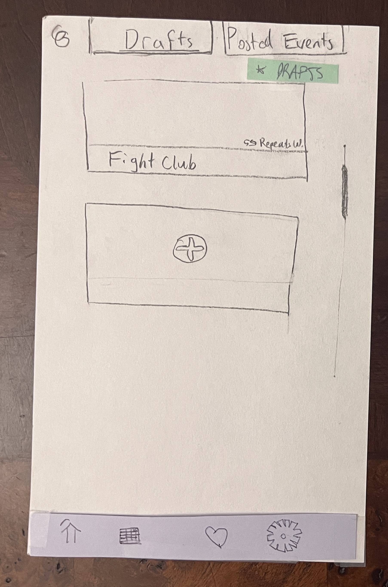
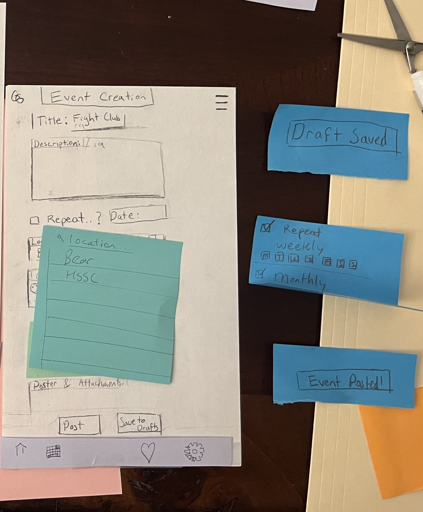
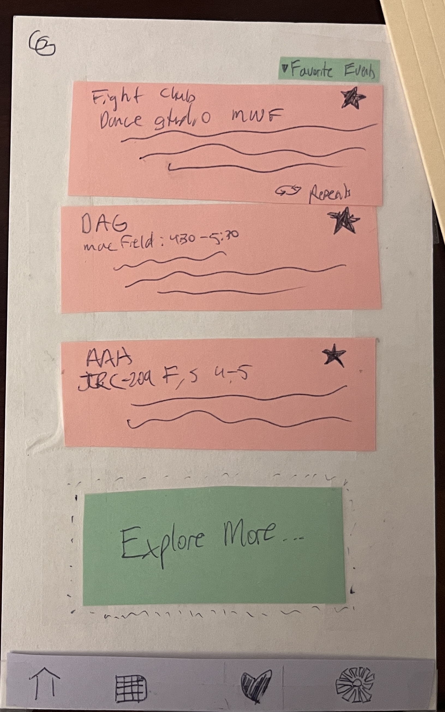
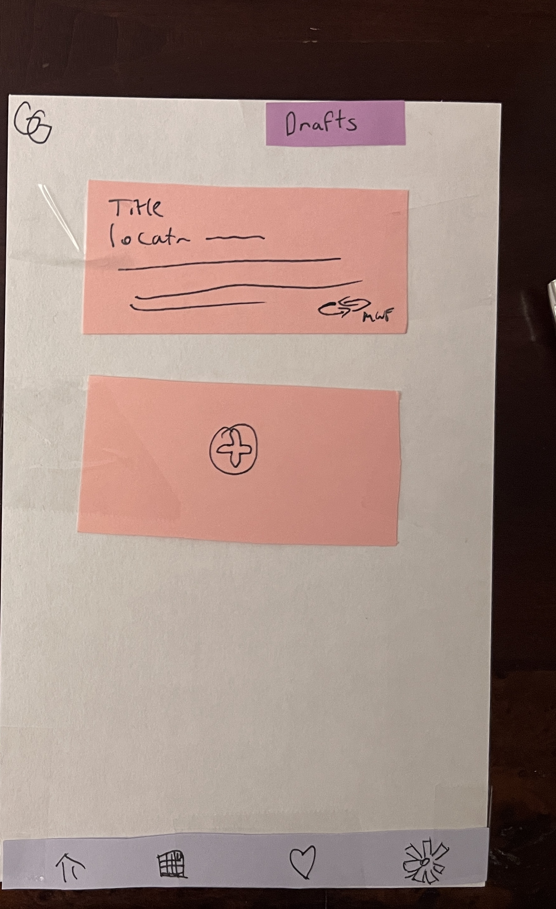
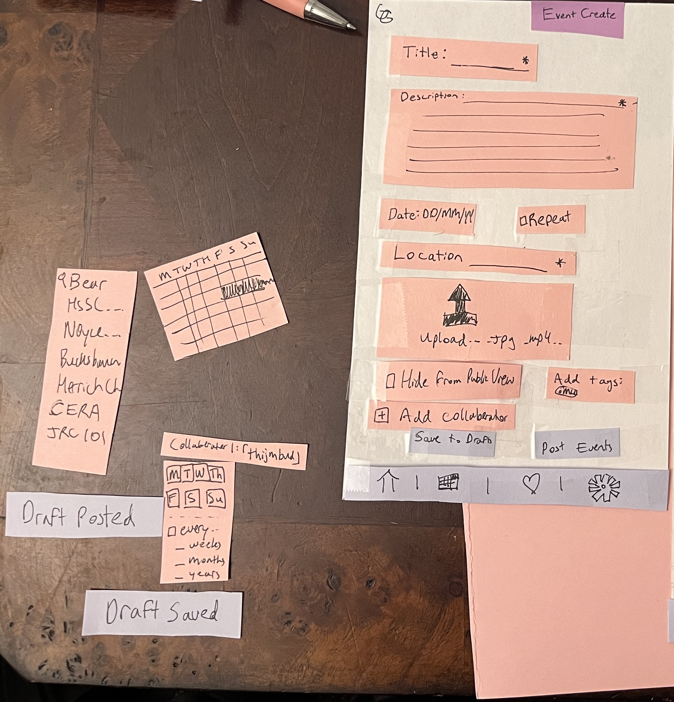
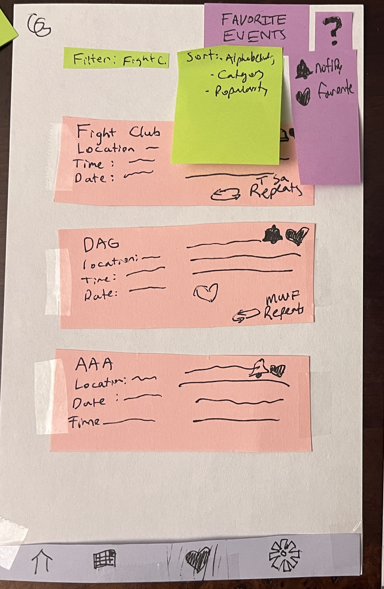
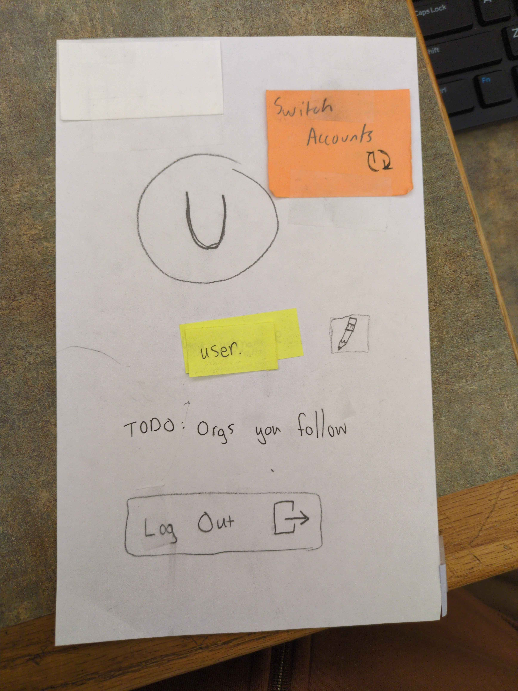
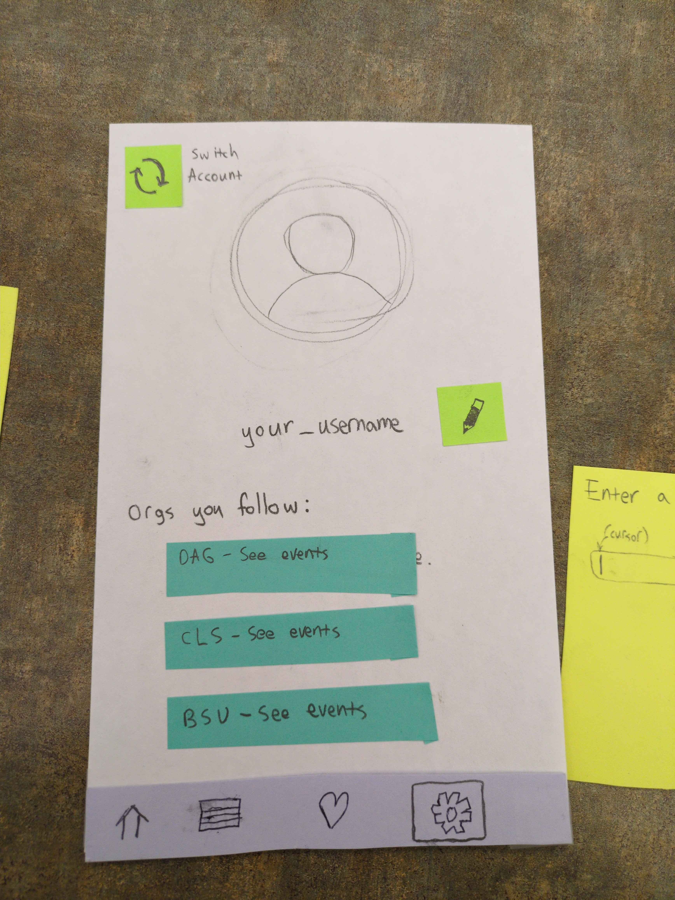
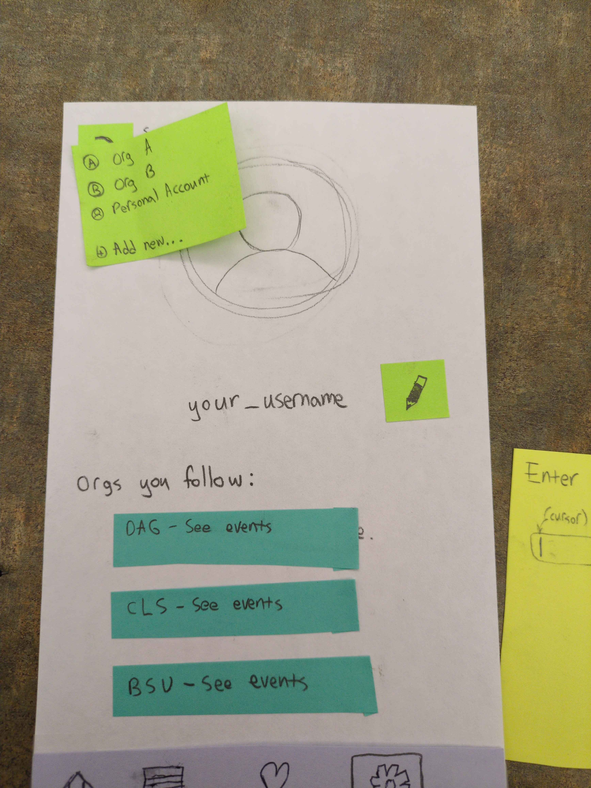
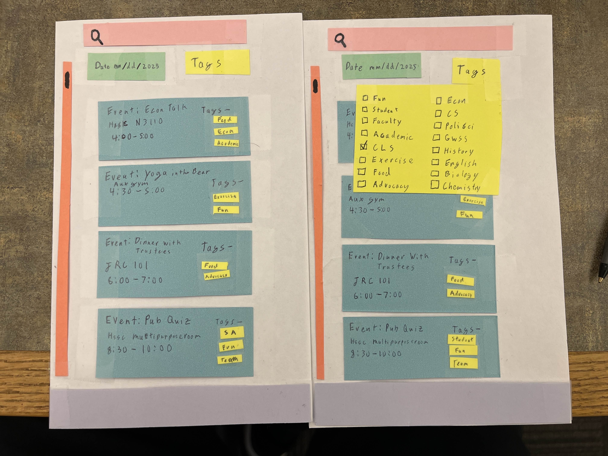

# Sprint 1 Journal

## Testing

### Mentor MockRun Destany Best
#### When 2/21/2025

#### A narrative describing the test.
- We followed a sandbox approach in our testing beginning as though she was starting the app for the first time. We had Destany go through the app at her own pace to attempt to see what features she would figure out or find that might be missing. Towards the end we made Destany an event creator user to test out our Event Creation features. After the demo we asked Destany for her general feedback, prompting with questions and asking for suggestions.

#### What roles did each team member play during the test?
- almond was the Computer
- Anthony was the Note Taker
- Ellie, Ethan, Budhil and Michael were Facilitators

#### Which user stories were activated?
- TO DO

#### Additional notes describing the session, e.g. observations of the test user's behavior.
- TO DO

#### The feedback you got from the tester

Events: A way to favorite a given event.

Calendar: How does she know what timeframe she is in?

Calendar: Add remaining bottom bar Icons

Event Creation: Location of repeat option

Event Creation: What does a successful event post look like?

Event Creation: What does setting the location look like?

#### Notes taken from session
- Events
    - Favorite button on each event 
- Calendar View
    - How does she know what timeframe she is in?
    - Add remaining Icons to the bottom bar
- Event Creation
    - Repeat on the right side of date (swap them)
    - How would she change the location? 
        - Search with a drop down
    - Restrict contact person?
    - Upload success?
        - Successfully posted
    - No Fight club card
- General Notes
    - Add Groups /  Friends section
    - Create something on calendar or profile settings instead of in likes
    - She wouldn’t have looked at likes to make the events
    - + in the calendar (maybe right side of the search bar)
    - Instead of contacts (Collaborators)
    - Where is time in the event creation?
    - Location Hidden or not?
    - Post an attachment upload
        - Where is the picture shown for an event?
    - Transparent tags
    - Add Switch Profile 
        - In the profile section
        - Circle Arrow
    - “Presented by” for events
    - Display name
    - Brand name / logo should be included
    - GetGrinnected on Sign-in

#### Notes on how to revise your testing procedure for the next user 
- A little more prepartion on how our flows opperate.
- If we allow a sandbox format for the test run (we can't assume we know what they are going to do so prepare to use alternate flows).

####  Changes to prototype

### Classmate Ella Berman
#### When: 2/21/2025

#### Narrative describing the test

What roles did each team member play during the test?
- almond was the Computer
- Anthony was the Note Taker
- Ellie, Ethan, Budhil and Michael were Facilitators

Which user stories were activated?
- We focused on user stories about being a non-power user, interacting with the parts of the UI that 

Additional notes describing the session, e.g. observations of the test user's behavior.
- TO DO

#### Feedback from tester

Calendar: How do I get to different views? (It needs to be more obvious how to change)

Calendar: A month view as the default is overwhelming, maybe a week view or a day view would be better.

Calendar: When in week view, can you swipe and/or press a button to change what week you are viewing? This would be good to add, intuitive way to want to interact.

Calendar: The day view where events are shown as overlapping is good.

Events: How do I know if an event is recurring?

Events: When I am creating event, how do I mark it as recurring? [After some explanation] Maybe that could be done differently to be more intutitive.

#### Notes Taken From Session

- Signup and Login
    - Update to add real password requirements
- Homepage
    - Scrolling capability?
- Calendar
    - How do I get to different views of calendar?
        - Might need to make this more pronounced
- Favorited Event
    - Recurring events how do I know?
- General Notes
    - Implement Follow orgs
    - View orgs that are a part of the app
    - Search of orgs and or events
    - Are tags Preset?
        - Yes, No custom tags
    - Only future Dates?
        - Yes
    - Date acts as a filter
    - Separate Week view From Month view
        - Rather see a week than a month
    - Settings to set default calendar view
    - Week view scrollable
    - Ability to set recurring events!
    - Favorite view was to see what was overlapping.
    - Ability to filter Calendar View?

#### Notes on how to revise your testing procedure for the next user

- Ensure we are not talking over test user when they are providing feedback
    - It is great to have ideas to fix or solve a problem, but very important to fully hear out the test user. Their thought process is crucial! (Proposing possible ideas for solutions after they have provided their full thoughts is a great idea!).

####  Changes to prototype

Based on user feedback:
- Update calendar to meet a few areas.
    - This involved changing the verbiage on the time view button from "time: day/month/year" to "view: day/month/year" to make it clearer it was switchable, to address confusion around how to switch between day, week, and month views
        - This also involved making the button for this in color rather than pencil, so it was more clearly interactable
    - Similarly, made the filter button colorable to show it is interactable, made a list of tags, and made some example screens with filters turned on to show what a filtered calendar might look like
    - Made additional screens for week and day views to simulate side scrolling to access the next time period, as this was an intutitive way the user tried to navigate in the calendar.
- User profile: Add account switcher, area for the orgs you follow.
- Login/Signup: Add the specific password criteria.

From our own thoughts and ideas:
- Make the user profile image change no longer a button

Not based on the testing session:
- None for this category

Photos of before and after:

- Calendar:
    - Before:       
    - After:  

- Event Creation:
    - Before: 
    - After: 

- Profile and Settings:
    - Before: 
    - After:  

- Homepage:
    - Before: 
    - TO DO: Is this being changed?

### Stakeholder Review: Lily

**Who:** Lily
- Lily is a naive user of this product
- 2nd year
- Not an org leader, just a normal user.

**When:** 2/24/2025

#### Narrative

We started off by introducing Lily to the general idea of what we were working on and why we were asking for her for help. Then we started at the login screen of the app and had her log in, then navigate the app towards what interested her. We finished up the session by asking her some closing questions, than thanked her for her help.

#### Team roles

Ethan and Ellie were facilitators, Michael was the computer, and Anthony and almond took notes as we went. Budhil couldn't be at this meeting due to scheduling.

#### User stories activated

Here are some that seem the most relevant.

- See upcoming events as a first year (Jessica)
- See only events that are relevant to you (Abby)
- Get updated on event time changes and cancellations (Sarah)

#### Session notes

This is a cleaned-up version of the notes taken live during the session, only the stuff that feels relevant to what this assignment is asking for.

- Use case: She wants to use her phone to check when stuff is going on (the Grinnell website doesn't satisfy this), but doesn't like getting news through Instagram.
- A question that came up multiple times: "How do I get back?"
    - Not familiar with the bottom bar layout
    - Don't dismiss this as "she's doing it wrong" -- this is useful feedback!
- **joke testimonial** (she really did say this): "The first rule of fight club is to put it on GetGrinnected"
- She tried clicking on the tags to see other things with that tag, which seems like something pretty intuitive and good to have.

#### Feedback from the tester

Also taken from session notes.

- When I tap on a day on the calendar, does it go to that day? Or the event my finger touched?
    - The size of actual phones compared to the prototype is very relevant here. (Similar to Leah's feedback from class today)
- Wants to see if a lot of people have also favorited an event.
- Why would I want to have more than one account?
    - Shows what this looks like from a non org leader perspective, doesn't really make sense.
- There should be a clearer indication that clicking on the photo in your profile will change it.
- It's good to have tags when viewing an event. 
- When an event gets cancelled, does the app notify me?
    - It probably should if you are subscribed to it, good to be thinking about now.

Question for her: What features might you want in an app like this?

- Pictures on the events.
- Social part is nice, but she doesn't feel it's necessary.
    - Discussion afterwards: Highlight this may not be true for all users, Ellie says Lily tends to care less about social features like this one.

Question for her: Did any parts of the interaction feel less intuitive?

- Home bar confusing, seems like it doesn't read well to her
- Scroll bar currently doesn't make sense

#### Changes to test procedure for next user

- She asked "is there something I'm missing?" when she was done looking around the prototype, for next user let's make our intro a little bit longer so it includes:
    - We are doing this at a very early stage of design, your feedback is vital
    - The actual procedure we are trying to follow with them
        - For future user tests, they are going to be power users / event creators so this will be part of the testing we make sure to do with them. Include this.
- Let's continue mixing up the roles so different people get different experiences.

### Revisions after meeting with Lily

Changes we agreed to make after the meeting on Feb 24:

- almond: Add a bubble or other element to the profile picture to make it clear clicking it will let you change photos
- Ethan: Make a flow for when you click on a tag, to view other things with that tag.
- Ellie: Make sure that all pages have the same icons on the bottom bar

TO DO: List any others we have here. I feel like we should have more revisions between these two parts.

### Stakeholder Review: Regan

**Who:** Regan
- Regan has heard of our product
- 3rd year
- SEPC Member, Event creator user.

**When:** 2/26/2025

#### Narrative

We started off introducing the general idea of our product to Regan, asking questions like "what would you expect to be able to do in said product? As an SEPC Leader what would you want from event creation?" Next we followed a sandbox approach where we let Regan try any path she felt, guiding her in the end to a few final unexplored features. After the completion of the demo we asked her a handful of questions and for her general feedback.

#### Team roles
 - Budhil (Computer)
 - Anthony (Facilitator)
 - Michael (Facilitator)
 - Ellie (Notetaker)
 - Ethan (Notetaker)

#### User stories activated

#### Session notes

#### Feedback from the tester

#### Changes to test procedure for next user

- Ensure we are giving our total attention to the stakeholder and respecting them and the time they are giving us.
- Do not shut down a stakeholder's idea infront of them (Take the note, not the fix).
- General disputes over how we can resolve a problem proposed by a stakeholder can be discussed after our time with the stakeholder.

### Revisions after meeting with Regan

- Changes we agreed to make after the meeting on Feb 26:
    - Anthony: Add a forgot password path.

### Stakeholder Review: Yuina

**Who:** Yuina
- Yuina is a naive user of our product.
- 4th year
- Event creator user.

**When:** 2/27/2025

#### Narrative

#### Team roles

#### User stories activated

#### Session notes

#### Feedback from the tester

#### Changes to test procedure for next user

### Revisions after meeting with Yuina

### CIDER Lab

#### Critique

- What assumptions about users were identified during the critique stage?
    - Light mode display was best for all users.
    - Ability to read smaller text on displays.
    - Some degree of knowledge of the UI.

#### Imagine

- Which assumption(s) did you choose to expand on for this phase?
    - Light mode
    - Ability to read smaller text
- How might that assumption exclude users?
    - Light Mode
        - This could exclude individuals who are overstimulated by the bright display.
        - This could exclude individuals who try to avoid bright displays towards night time.
    - Ability to read smaller text
        - Those with sight impairments may struggle to read the information.

#### Design

- What are your ideas for redesigning your product based on critique?
    - Light Mode
        - We can offer a customization of display colors (Light/Dark Mode, custom colors, etc.)
    - Sight Impaired
        - An ability to set text size.
        - Potentially a way to zoom in on information.

- 
