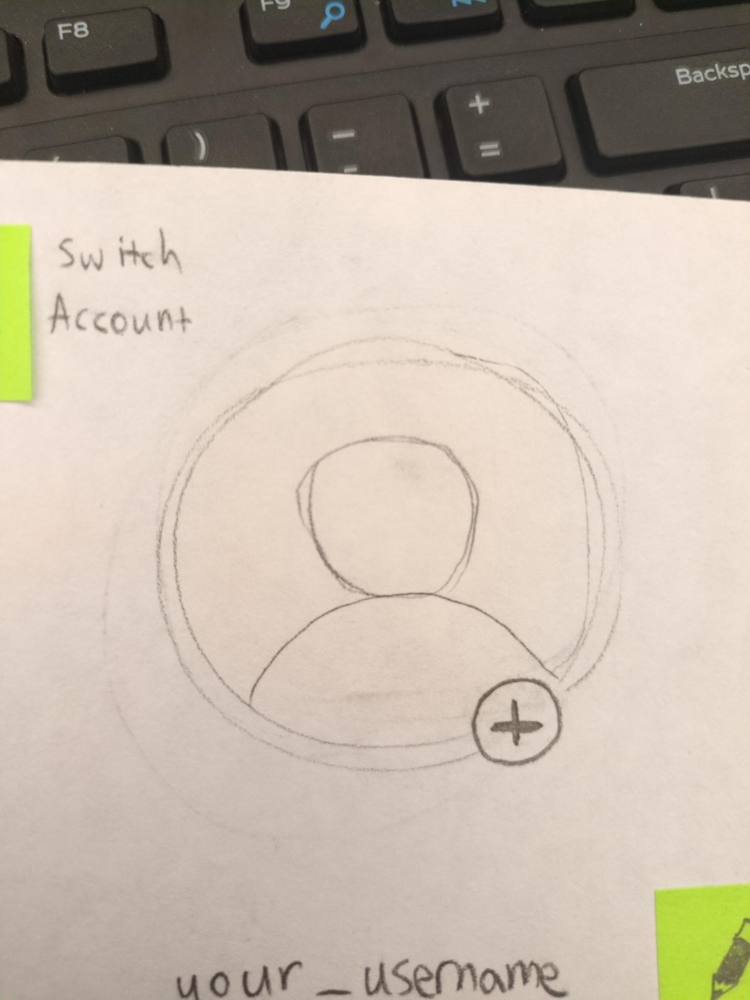

# Sprint 1 Journal

## CSC-324 Class Testing 

### Mentor MockRun Destany Best
#### When 2/21/2025

#### A narrative describing the test.
- We followed a sandbox approach in our testing beginning as though she was starting the app for the first time. We had Destany go through the app at her own pace to attempt to see what features she would figure out or find that might be missing. Towards the end we made Destany an event creator user to test out our Event Creation features. After the demo we asked Destany for her general feedback, prompting with questions and asking for suggestions.

#### What roles did each team member play during the test?
- almond was the Computer
- Anthony was the Note Taker
- Ellie, Ethan, Budhil and Michael were Facilitators

#### Which user stories were activated?

- Jessica makes sense as for knowing what events are coming up.
- Jack makes sense for advertising to whole campus vs. established members.

#### The feedback you got from the tester

Events: A way to favorite a given event.

Calendar: How does she know what timeframe she is in?

Calendar: Add remaining bottom bar Icons

Event Creation: Location of repeat option

Event Creation: What does a successful event post look like?

Event Creation: What does setting the location look like?

Event Creation: Where we create events is unintuitive.

Event Creation: Is there a way to upload an image with an event?

Profile: A way to switch between profiles?

Profile: Display Name vs. Username

General: Add an Orgs / Friends feature section.

General: Inclusion of logo places as well as GetGrinnected.

#### Notes taken from session
- Events
    - Favorite button on each event 
- Calendar View
    - How does she know what timeframe she is in?
    - Add remaining Icons to the bottom bar
- Event Creation
    - Repeat on the right side of date (swap them)
    - How would she change the location? 
        - Search with a drop down
    - Restrict contact person?
    - Upload success?
        - Successfully posted
    - No Fight club card
- General Notes
    - Add Groups /  Friends section
    - Create something on calendar or profile settings instead of in likes
    - She wouldn’t have looked at likes to make the events
    - + in the calendar (maybe right side of the search bar)
    - Instead of contacts (Collaborators)
    - Where is time in the event creation?
    - Location Hidden or not?
    - Post an attachment upload
        - Where is the picture shown for an event?
    - Transparent tags
    - Add Switch Profile 
        - In the profile section
        - Circle Arrow
    - “Presented by” for events
    - Display name
    - Brand name / logo should be included
    - GetGrinnected on Sign-in

#### Notes on how to revise your testing procedure for the next user 
- A little more prepartion on how our flows opperate.
- If we allow a sandbox format for the test run (we can't assume we know what they are going to do so prepare to use alternate flows).

####  Changes to prototype

 - Finalize bottom bar capabilities and the four major windows of the app
 - Circled which element of the botttom bar the user was on.
 - Changed location of add event
 - Fleshed out more availabele events that could be clicked
 - Created a keyboard for realism

### Classmate Ella Berman
#### When: 2/21/2025

#### Narrative describing the test

We started the test by giving a brief introduction about our general product. We then started Ella on the login/signup page and let her flow through the app like it was her first time openning it (More of a sandbox flow). She would ask questions as we went through and we would provide any answers. Additionally towards the end we prompted paths that had not been taken. In the end we asked a variety of questions to gain feedback and user insights.

#### What roles did each team member play during the test?

- almond was the Computer
- Anthony was the Note Taker
- Ellie, Ethan, Budhil and Michael were Facilitators

#### Which user stories were activated?

We focused on user stories about being a non-power user, interacting with the parts of the UI that 

#### Feedback from tester

Calendar: How do I get to different views? (It needs to be more obvious how to change)

Calendar: A month view as the default is overwhelming, maybe a week view or a day view would be better.

Calendar: When in week view, can you swipe and/or press a button to change what week you are viewing? This would be good to add, intuitive way to want to interact.

Calendar: The day view where events are shown as overlapping is good.

Events: How do I know if an event is recurring?

Events: When I am creating event, how do I mark it as recurring? [After some explanation] Maybe that could be done differently to be more intutitive.

#### Notes Taken From Session

- Signup and Login
    - Update to add real password requirements
- Homepage
    - Scrolling capability?
- Calendar
    - How do I get to different views of calendar?
        - Might need to make this more pronounced
- Favorited Event
    - Recurring events how do I know?
- General Notes
    - Implement Follow orgs
    - View orgs that are a part of the app
    - Search of orgs and or events
    - Are tags Preset?
        - Yes, No custom tags
    - Only future Dates?
        - Yes
    - Date acts as a filter
    - Separate Week view From Month view
        - Rather see a week than a month
    - Settings to set default calendar view
    - Week view scrollable
    - Ability to set recurring events!
    - Favorite view was to see what was overlapping.
    - Ability to filter Calendar View?

#### Notes on how to revise your testing procedure for the next user

- Ensure we are not talking over test user when they are providing feedback
    - It is great to have ideas to fix or solve a problem, but very important to fully hear out the test user. Their thought process is crucial! (Proposing possible ideas for solutions after they have provided their full thoughts is a great idea!).

####  Changes to prototype

Based on user feedback:
- Update calendar to meet a few areas.
    - This involved changing the verbiage on the time view button from "time: day/month/year" to "view: day/month/year" to make it clearer it was switchable, to address confusion around how to switch between day, week, and month views
        - This also involved making the button for this in color rather than pencil, so it was more clearly interactable
    - Similarly, made the filter button colorable to show it is interactable, made a list of tags, and made some example screens with filters turned on to show what a filtered calendar might look like
    - Made additional screens for week and day views to simulate side scrolling to access the next time period, as this was an intutitive way the user tried to navigate in the calendar.
- User profile: Add account switcher, area for the orgs you follow.
- Login/Signup: Add the specific password criteria.
- Added capability to favorite events and associated UI pop-up  

From our own thoughts and ideas:
- Make the user profile image change no longer a button

Not based on the testing session:
- None for this category

Photos of before and after:

- Calendar:
    - Before:       
    - After:  

- Event Creation:
    - Before: 
    - After: 

- Profile and Settings:
    - Before: 
    - After: 

- Homepage:
    - Before: 
    - After: 

- Login/Signup pages:
    - Before:  
    - After:  

## Stakeholder Testing
### Stakeholder Review: Lily

**Who:** Lily
- Lily is a naive user of this product
- 2nd year
- Not an org leader, just a normal user.

**When:** 2/24/2025

#### Narrative

We started off by introducing Lily to the general idea of what we were working on and why we were asking for her for help. Then we started at the login screen of the app and had her log in, then navigate the app towards what interested her. We finished up the session by asking her some closing questions, than thanked her for her help.

#### Team roles
- Michael was the computer
- Ethan and Ellie were facilitators
- almond and Anthony took notes
- Budhil could not attend due to scheduling

#### User stories activated

Here are some that seem the most relevant.

- See upcoming events as a first year (Jessica)
- See only events that are relevant to you (Abby)
- Get updated on event time changes and cancellations (Sarah)
- Save events of interest (Jessica)

#### Session notes

This is a cleaned-up version of the notes taken live during the session, only the stuff that feels relevant to what this assignment is asking for.

- Use case: She wants to use her phone to check when stuff is going on (the Grinnell website doesn't satisfy this), but doesn't like getting news through Instagram.
- A question that came up multiple times: "How do I get back?"
    - Not familiar with the bottom bar layout
    - Don't dismiss this as "she's doing it wrong" -- this is useful feedback!
- **joke testimonial** (she really did say this): "The first rule of fight club is to put it on GetGrinnected"
- She tried clicking on the tags to see other things with that tag, which seems like something pretty intuitive and good to have.

#### Feedback from the tester

Also taken from session notes.

- When I tap on a day on the calendar, does it go to that day? Or the event my finger touched?
    - The size of actual phones compared to the prototype is very relevant here. (Similar to Leah's feedback from class today)
- Wants to see if a lot of people have also favorited an event.
- Why would I want to have more than one account?
    - Shows what this looks like from a non org leader perspective, doesn't really make sense.
- There should be a clearer indication that clicking on the photo in your profile will change it.
- It's good to have tags when viewing an event. 
- When an event gets cancelled, does the app notify me?
    - It probably should if you are subscribed to it, good to be thinking about now.

Question for her: What features might you want in an app like this?

- Pictures on the events.
- Social part is nice, but she doesn't feel it's necessary.
    - Discussion afterwards: Highlight this may not be true for all users, Ellie says Lily tends to care less about social features like this one.

Question for her: Did any parts of the interaction feel less intuitive?

- Home bar confusing, seems like it doesn't read well to her
- Scroll bar currently doesn't make sense

#### Changes to test procedure for next user

- She asked "is there something I'm missing?" when she was done looking around the prototype, for next user let's make our intro a little bit longer so it includes:
    - We are doing this at a very early stage of design, your feedback is vital
    - The actual procedure we are trying to follow with them
        - For future user tests, they are going to be power users / event creators so this will be part of the testing we make sure to do with them. Include this.
- Let's continue mixing up the roles so different people get different experiences.

#### Changes to prototype

Profile Page:
- Before: 
- After:  
    - Now also includes a place to find a list of all student orgs with info, and follow those of interest
    -     

### Revisions after meeting with Lily

Changes we agreed to make after the meeting on Feb 24 (these also may include feedback we recieved from our test session with Leah):

- almond: Add a bubble or other element to the profile picture to make it clear clicking it will let you change photos
- Ethan: Make a flow for when you click on a tag, to view other things with that tag.
- Ellie: Make sure that all pages have the same icons on the bottom bar.
- Ellie and Ethan: Added a way to view a list of organizations + follow ones of interest
- Budhil: Added an introductory survey to better suit the users interests.

### Stakeholder Review: Regan

**Who:** Regan
- Regan has heard of our product
- 3rd year
- SEPC Member, Event creator user.

**When:** 2/26/2025

#### Narrative

We started off introducing the general idea of our product to Regan, asking questions like "what would you expect to be able to do in said product? As an SEPC Leader what would you want from event creation?" Next we followed a sandbox approach where we let Regan try any path she felt, guiding her in the end to a few final unexplored features. After the completion of the demo we asked her a handful of questions and for her general feedback.

#### Team roles
 - Budhil (Computer)
 - Anthony (Facilitator)
 - Michael (Facilitator)
 - Ellie (Notetaker)
 - Ethan (Notetaker)

#### User stories activated

- See only events that are relevant to you 
- Save events of interest 
- Event Creation for student org

#### Session notes

This is a condensed list of the notes taken during our session.

- Survey should include the ability to add majors and concentrations
- How many following tags should we have in the survey?
- Why would you want a private event?
    - How would seeing it work?
- What does following an Org do? How does it change the view of the rest of the app?
- Going from favorite events into draft feels unintuitive.
- What filters would we have for the favorite events tab?
- Can we create tags?
    - General consensus no.
- What does the link for RSVP mean?
    - Link to external source to track RSVPs.
- Should clicking on an event in week view of calendar take you to the event or to a week view?

#### Feedback from the tester

Survey: A lot of tags you have to click?

Event Creation: What if the location I want to host at is not included in the drop down?

Event Creation: How do private events work on our app? How would someone be able to see a private event?

General: We need a signout option / flow

General: What does a comprehensive list of possible event tags look like? How would we establish this list?

What was useful: Filters, Calendar, Favorites, Notifications

Final Thoughts: It will be nice to have a central place to disseminate information. Not just boards in buildings to advertise events.  

#### Changes to test procedure for next user

- Ensure we are giving our total attention to the stakeholder and respecting them and the time they are giving us.
- Avoid shutting down a stakeholder's idea infront of them (Take the note, not the fix).
- General disputes over how we can resolve a problem proposed by a stakeholder can be discussed after our time with the stakeholder.

### Revisions after meeting with Regan

No substantial revisions between Regan and Yuina's testing due to the quick turn around.

### Stakeholder Review: Yuina

**Who:** Yuina

- Naive user
- 4th year
- Org leader (president of ISO: International Student Organization)

**When:** 2/27/2025

#### Narrative

We decided not to give a full explanation of the app to Yuina, instead asking her what she thought an app called "GetGrinnected" would do. Then, we had her go though the app as she saw fit, mostly not providing direct guidance on what different buttons did.

When it came to some of the org leader role specific things (creating and saving events) we did provide pointers for where to click such as clicking on the "+" button on the calendar.

#### Team roles
- Ellie was computer
- Budhil and Anthony were facilitators
- almond and Michael were note takers
- Ethan could not attend due to scheduling

#### User stories activated

- Connect wih other SEPCs (orgs) to collaborate on a larger scale event (Ji-Ho)
- Students easily be able to contact the SEPC (org) (Ji-Ho)
- Distribute tickets so event's don't overfill (Ochen)
- Send notifications to an org mailing list (Ochen)
- Save events of interest (Jessica)

#### Session notes

##### Pre-testing questions

What do you think an app called "GetGrinnected" would do, knowing nothing else about it?
- Help get connected with other Grinnellians?

##### Testing: Personal account

Cleaned-up version of live meeting notes.

---

Decided to skip the intro survey, since it was optional.
- When asked afterwards, said this was because she didn't think it would be necessary at that point.

Went straight to the tags selector, could be because she saw the tags view by mistake but this is still worth noting

Then clicks the date filter, but decides not to do it after seeing the menu.

Favorites an event, after checking that she can do that.

Not sure what calendar button is on the home screen
- Agrees the icon on other screens is easier to understand. This specific instance is just not.
    - Seems to be an issue of drawing style. Calendar should be more grid, less lines, pictorally

In settings, clicks on find orgs and taps AAA. That pulls up the info box for AAA, and she hearts it.
- It takes a few layers of taps to get back to the settings page.

**EXTRA IMPORTANT**: "Is there more to see for the orgs, what events they have and stuff?"
- Feature request for being able to somehow see org-specific events *from this page*

##### Testing: Student Org account

Switches from personal to student org account, it seems like that UI element reads well. Although she seems very quick at understanding all sorts of UI stuff, which not all testers have been--so take this with a grain of salt.

We pretend she already registered an org account, skipping those steps for now

Now, in calendar view, we direct her to the plus button to create an event. She clicks it and goes over the event creation screen.

- "Can I make my own tags?" -> has been asked before. Our answer is no, but we've been wanting to reach out to orgs and ask them what tags they want.

Uploads the poster for the event.

Asks if she can also add the time, the answer to this is yes.

Decides to post the event immediately when it's done.

On the favorites screen:
- "Does this show the stuff I've favoritied? Like the org and the event" 
    - What would make sense to you? -> "Only showing the events"
- "Can I filter the favorites by org?"
- "How can you tell it is popular?" -> lots of people liked it
    - "Can you see how many people have liked it in the actual UI?"

- "What does add collaborator do?"

#### Feedback from the tester

Unexpected positive things?
- Really likes the calendar, you can see when everything is.
    - Prefers month view to the scrolling view on the homepage
    - Likes how it's filterable

Negative things?
- If there is a graphic for an event, can it show in the background?
    - After meeting we made sure to talk a bit about the accessibility implications on this. It would need to be a compromise.
- If you open the org page, graphics for that org could also be shown

Why'd you skip the survey? What might encourage you to actually do it?
- Skipped because felt unnecessary
- Fewer questions might help
- It could also ask about what orgs you wanna learn about, rather than what major you are.

If we did a "would you like to take a short survey? y/n" would you be more likely to do that?
- No, the format we use now would be more compelling

Anything particularly intuitive or unintuitive in the UI?
- Favorites view is good, does what she expects.
- Wasn't sure what the calendar icon was
- Didn't really know what the home button would do

Looking ahead, you mentioned you wanted to create tags. Were there any in particular you had in mind?
- International
- Cost
- If as an org you could make tags, she'd make an "ISO" tag.
- Food is a good tag to have

How was the experience between using the personal and student org account?
- Very straightforward.

What priveleges would you expect a student org account to have?
- Security concern: You can only access student org email if your personal is linked, and this doesn’t seem to require that.

General experience w/ event creation?
- It would be nice if it showed on calendar as a draft when you save as a draft.

How could the process of event creation be made more accessible?
- Honestly, seems good as it is.
- She doesn't have anything else she'd wanna see.

If someone added your org as a collaborator, what would you expect that to look like?
- If open events, should show up in there. But events on homepage & elsewhere don’t say what org it is. It could show the collaborating orgs.

Thoughts on receiving notifications if an event is updated?
- Very common for location or time to change. Would be nice.

How do you believe this app would impact your day to day planning for org events?
- Currently looks at 25live to do that
- If this becomes a thing, it would be easier to access than that.
- Tend to avoid similar events on the same day, this would be useful for that.

As a leader of an MLC, are there any things your org needs that we don’t seem to offer or that general student orgs wouldn’t need?
- An event they held last sem was a collab with almost all the international MLCS (ISO + 10 MLCs + other international cohorts). In terms of representing “rare birds”, would be nice to have them added even though they are not an org with the college.
- If that could be seen visually, it would be nice. To show it’s a huge collaboration.

Who should we reach out to about this to get the word out?
- Probably not ITS
- Vrinda Varia
- Athletic departments

#### Changes to test procedure for next user

There is no next user we are testing with. If we did more paper prototyping, we would make these changes to the testing procedure.

- Give slightly more background on our goals with the app.

Other than that, we're pretty happy with how our testing procedure went today.

### Revisions after meeting with Yuina

- Place to display image for an event.
- A way for image associated with event to display in-app in a way that is previewable to org
- We reordered the order of questions for the survey. 

Images of changes:

Images of event display in app
- before
    - 
- after
    -   

Searching multiple orgs / Collaborators
- 

Ability to add multiple collaborators
- before
    - 
- after
    - 

Images of Survey
- before
    - 
- after
    - 

## CIDER Lab

#### Critique

- What assumptions about users were identified during the critique stage?
    - Light mode display was best for all users.
    - Ability to read smaller text on displays.
    - Some degree of knowledge of the UI.

#### Imagine

- Which assumption(s) did you choose to expand on for this phase?
    - Light mode
    - Ability to read smaller text
- How might that assumption exclude users?
    - Light Mode
        - This could exclude individuals who are overstimulated by the bright display.
        - This could exclude individuals who try to avoid bright displays towards night time.
    - Ability to read smaller text
        - Those with sight impairments may struggle to read the information.

#### Design

- What are your ideas for redesigning your product based on critique?
    - Light Mode
        - We can offer a customization of display colors (Light/Dark Mode, custom colors, etc.)
    - Sight Impaired
        - An ability to set text size.
        - Potentially a way to zoom in on information.

## Storyboard

Our Storyboard shows a student walking back to their dorm and longing in their bed looking for something to do. They open GetGrinnected and scroll through some events occurring today. They see that there is a GORP hike that sounds interesting so they click on the event and read more information about it. It sounds like a fun event that they can enjoy so they meet up outside the JRC with other GORP members and have an amazing time. The user is motivated by boredom to find out what's going on around campus. They react with curiosity and interest in the potential events available to them. It ends in interactions in the cummunity as it links the user with opportunities available to meet up and talk to fellow students at the activity. This shows off our app's use in quickly finding events on campus and meeting up with other students to find fun and meaningful ways to engage in the campus community. 
