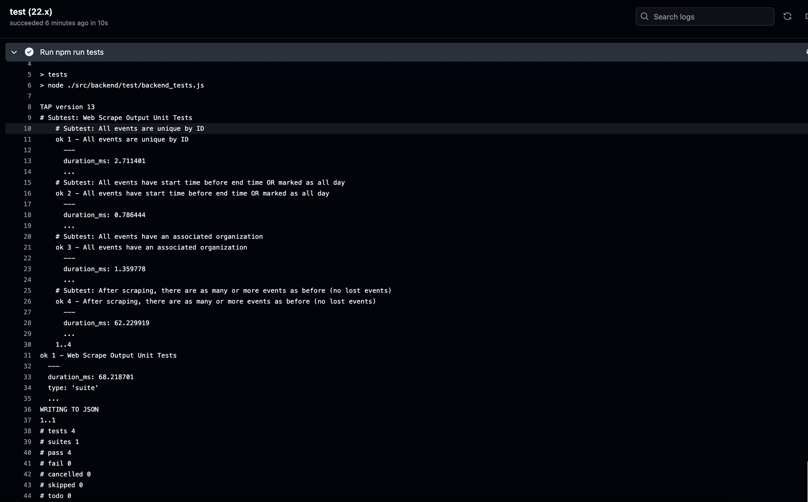
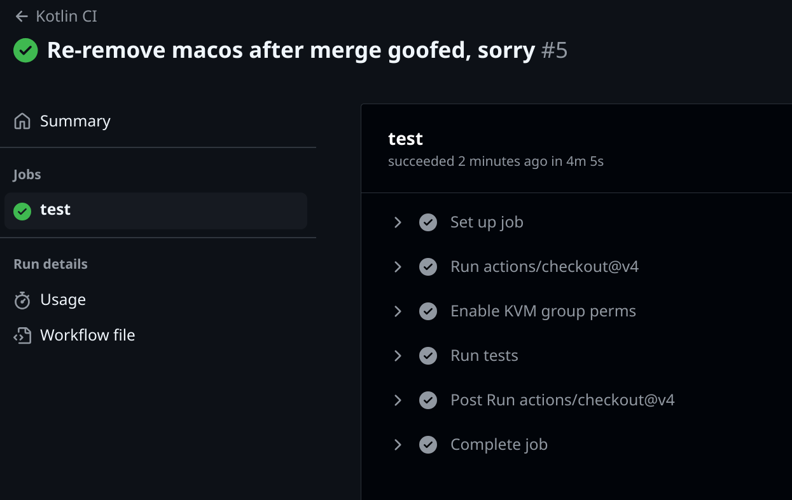

# Part 2: Software Architecture

## Decision 1

At least for the time being, we have decided it is most realistic for us to have a single instance of our database. This is reflected in architecture diagram by the existence of only one server component in the bottom layer.

**Alternative:** The alternative is to utilize more than one instance of the database--physically separate copies if possible. This has several pros that are attractive to us:
- Resilience against data loss (e.g. corruption, hardware failure, or disasters that take down servers)
- Better scaling to a larger number of requests
- Each instance can afford to have lower resources without impacting performance significantly

However, there are cons that led to us not choosing this for the time being. The main one is that at this stage, it does not seem possible for us to get access to more than one server that can run a database--especially for free. We may reconsider this if circumstances change. It is a smaller aspect, but such a configuration also has a higher up-front labor cost.

We ended up deciding to make the database an entire layer in order to make switching to a distributed database such as MongoDB easier if we need to reverse this decision later in the process.

## Decision 2

We decided to classify the scraper component just above the data access layer, rather than further up.

**Alternative:** In particular, one alternative we considered was placing the scraper on the same layer as the clients. That is, it would run unrelated to the server and make API requests.

The main reason we were considering this was that it made organizational sense at one point in the process, when allowing users to add events was a central part of the functionality of the app. However, we later decided to scale back that aspect of the scope which would mean the API would require routes only used by the event scraper. This seemed like a bad idea.

Additionally, we decided to classify the scraper as we did because it makes the most sense to run it on Reclaim Cloud with other parts of the app, as opposed to an alternative like running it through Github actions which would use up our CI minutes quickly.

Reversing this decision wouldn't be the simplest thing, but we might decide to do so if we end up letting users post events. This would let it take advantage of existing systems in order to function, and keep it in line with the 'rules' of other parts of the system.

# Part 5: Process Description

## 5.1: Risk Assessment
### Risk 1 - Unable to link our mySQL database with our GitHub repository within timeframe.
- Likelihood of occurring: medium

- Impact if it occurs: high

- Evidence for estimates
  - We have already had some issues with connecting to our database. If we are not able to connect to our database, we will not be able to automatically update our deployed code.

- Steps to reduce the likelihood or impact, and steps to get better estimates
  - We will reduce the likelihood by figuring out how to connect our database to our GitHub.

- Plan for detecting the problem
  - We will detect this problem by attempting to automatically connect to our database, and succeeding or failing within our deadlines.

- Mitigation plan should it occur
  - Manually copy our code to our mySQL database when we update the software.

### Risk 2 - Not enough people using our app.
- Likelihood of occurring: medium

- Impact if it occurs: medium

- Evidence for estimates
  - We have had interest in using the app expressed by all students we have told about it. If we do not have many users it will not be a massive issue because we are not longer using user generated content.
  - That being said, we still cannot be 100% sure of its widespread use, especially if our features are cut short due to time restraints. 

- Steps you are taking to reduce the likelihood or impact, and steps to permit better estimates
  - We are planning to spread knowledge of our app through word of mouth and our connection in the college.

- Plan for detecting the problem
  - We will monitor the amount of traffic our server gets.

- Mitigation plan should it occur
  - We will contact people we know at the college to spread word of the app.
  - Make a quality app according to our specifications.

### Risk 3 - Unable to finish our app before the end of the semester.
- Likelihood of occurring: low

- Impact if it occurs: high

- Evidence for estimates
  - We feel that we will be able to finish the app in time since we reduced our features. If we are unable to finish the app, that would be a large issue.

- Steps you are taking to reduce the likelihood or impact, and steps to permit better estimates
  - Planning, communication, and teamwork.

- Plan for detecting the problem
  - We will discuss if we feel like we are behind schedule at our weekly meetings.

- Mitigation plan should it occur
  - We will reduce our features/scope or change our development schedule.

## 5.2: Epics
### Epic 1 - Home Page for Easy daily event aggregation 
#### Introduction: 
There should be an easy way to see what is happening on campus so that students can easily find ways to get involved. 
#### User Stories:
- Jessica is a 1st year and wants to learn what events are happening on campus
    - As Jessica, I need to be able to see upcoming events so that I can attend them and get involved.
    - As Jessica, I need to be able to save events I'm interested in so that I can remember they exist
    - As Jessica, I need to be able to learn what organizations exist on campus so that I can learn more about campus life and determine how I fit
- Megan is a 2nd year and wants to figure out what major they want to declare.
    - As Megan, I need to be able to sort events so that I only see those related to majors.
    - As Megan, I need to be able to see major related events so that I can attend major presentations and other related events to determine my future major.
    - As Megan, I need to find out about talks on campus to gauge my interest with the topics and the departments
- Chris is a 4th year and wants to apply to Grad School
    - As Chris, I need to know about CLS events to help me apply 
    - As Chris, I need to know about visiting Grad schools so I can attend and figure out where I want to apply
- Sarah is a 3rd year involved in multiple student organizations and interested in trying new ones.
    - As Sarah, I need something to do on Thursday afternoons, so that I don't get bored in my dorm.
    - As Sarah, I need to do get updated on any time changes or cancellations to events so that I don't miss my regular activities
    - As Sarah, I need to be able to distinguish between different types of events so that I can easily determine which ones match the interests I have my current orgs don't meet
- Brock is a 3rd year club organizer and wants people to attend their new organization
    - As Brock, I need to advertise my events and engage interested students
#### Product Requirements:
- Easily display upcoming events this week
- Updates daily to ensure accurate events
- Can be sorted to help students find events of interest
- Events have location time and description
#### Technical Requirements:
- Scrape data from Grinnell Events
- Format data into easily understood format
- Run on IOS and android systems
- Loads quickly 
- Updates daily 
#### Feedback:
- Destiny - Mentor
    - Mentioned favorite button for events
- Ella - Classmate
    - Needs to know if event is recurring 
- Lily - normal student
    - Would like pictures on the events
    - Excited to have access to information on phone
- Regan - SEPC leader
    - Need a comprehensive list of tags
#### Metrics:
- Easy to use
- Accessible to everyone

### Epic 2 - Profile Page 
#### Introduction: 
The app needs a place to manage your profile 
#### User Stories:
- Ji-Ho is a 3rd year SEPC member and runs two student orgs
    - As Ji-Ho I need to quickly switch between accounts to manage my orgs 
    - As Ji-Ho I need to set different profile pics to help me differentiate my profiles 
    - As Ji-Ho I need to know which profile I am on 
- AJ is a 2nd year who doesnt like leaving accounts signed in and has Blue-Yellow color blindness
    - As AJ I need a way to log out of my account when I am done using it
    - As AJ I need a way to switch the color scheme to something I can read easily
    - As AJ I need my settings to  save so I don't need to navigate and change the settings every time I log in
- Jess is a first year who plans her days the night before and has trouble reading small text
    - As Jess I need a darkmode on the app to reduce eye strain when I use it in dark conditions and lowers blue light that wakes you up
    - As Jess I need a way to increase the text size so I can read it
#### Product Requirements:
- Allows user to sign out of their profile
- Allows user to change between profile
- Allows users to change their profile image to any image in their photo library
- Allows you to change settings
- Settings for text size for accessibility
- Settings for color schemes compatible with different color blindnesses
- Setting for light vs dark mode to reduce eye strain 
#### Technical Requirements:
- Keeps track of individual users, their accounts, and saved settings 
- Applies changes in settings across the app on every screen
- Have multiple color palettes available that address different types of color blindness
- App has access to users photo library
#### Feedback:
- Regan 
    - Should have a sign out option
- Yuina 
    - If you have multiple accounts they should be linked 
- CIDER Lab
    - Should have a light and dark mode 
    - Should have a way to zoom in or increase text size
#### Metrics:
- Easy to use
- Accessible to everyone

### Epic 3: Event Creation, Management, Updates
#### Introduction: 
Collaboration, Outreach, Event Creation, Event Management, and Event Updates, for RSO autonomy, popularization of events, and the in-app accuracy of real-world events.
#### User Stories
- Abdul (MSA)
    - As Abdul, I need to notify non-members after my event is finished, in case there is extra food or drinks, so that the food we bought does not go to 
- Ji-ho (Anthro SEPC)
    - As Ji-ho, I need to connect with other SEPCs to collaborate on a larger scale event, so that we can pool our funds and break down barriers between majors.
    - As Ji-ho, I need students to be able to easily contact us (the SEPC) in case they have any complaints about professors, classes, or the major organizations, so that we as the SEPC can fulfill our duty to be there for students.
    - As Ji-ho, I need to be able to advertise events that are hosted outside standard academic buildings, so that I can facilitate SEPC activities in all the locations that are relevant to the department—such as CERA
- Ochen (ISO)
    - As Ochen, I need to receive feedback on larger scale events so that we can improve on our event for future years.
    - As Ochen, I need to distribute tickets for the food bazaar so that not too many people sign up to our events.
    - As Ochen, I need to gather volunteers for larger events so that I don’t overextend myself with the event so that I can prioritize my academics.
    - As Ochen, I need to allow people to be aware of a vote that is ongoing for the next year’s cabinet members, so that we have leadership that is representative of our organization’s student body.
- Sampson
    - As Sampson, I need the ability to read the app so that I can use the app
- Jessica
    - As Jessica, I need to be able to learn what organizations exist on campus so that I can learn more about campus life and determine how I fit
- Rūta
    - As Rūta, I need to coordinate simultaneous events so that I can do my job effectively for multiple departments who may have overlapping events.
- Jack
    - As Jack, I need to be able to include students who aren’t formally leadership in my org in event management so they can learn what to do to keep the org running once I graduate.
    - As Jack, I need to advertise some events to the whole campus community and others to just my orgs existing membership so that we can distinguish our big events from the regular meetings necessary to plan them.
- Abby
    - As Abby, I need to only see events that are relevant to me so I’m not overwhelmed with all the options.
- Sarah
    - As Sarah, I need to do get updated on any time changes or cancellations to events so that I don't miss my regular activities
    - As Sarah, I need to be able to distinguish between different types of events so that I can easily determine which ones match the interests I have my current orgs don't meet
- Zach
    - As Zach, I need to know if an organization is open to new members or people just stopping in so that I know I am welcome to attend
- almond
    - As almond, I need to be able to delete events which have passed or are not appropriate so that events are up to date and I can remove things that are against the content policy.
    - As almond, I need to control who can edit an event so only people in charge of it can update the details.
#### Product Requirements: functional and non-functional requirements. How each element of this “what” will be implemented
-  Event Creation
    - An event can be created in-app and be posted to the app calendar.
    - Posters, if any, can be posted and viewed on the Event Card.
    - Collaborator organizations (or students) can be an option to be added. (Jack)
    - A event chat with all collaborators for event preparations (stretch or out of scope).
    - Location options should not be limited to those listed in 25live, or standard academic buildings. (Ji-ho)
    - Tickets or a link to tickets should be able to distributed; additionally, volunteers can be gathered through the app through a link in the description or qr on the in-app poster. (Ochen)
    - Special event tags, so that very important events are highlighted in the events tab/home page. For example: cabinet elections for ISO. (Ochen)
    - While selecting date of event, ability to see the event in relation to other events, while also noting their size—so that many large events don’t clash. (Rūta)
    - Distinguishing between regular, small, big, and very important events. (Jack)
    - Compulsory tagging so normal users see “only events that are relevant” to them, or events from organizations they are not following (Abby, Jessica, Sarah).
    - Distinguish between more open events, and between events that encourage people to “stop by.” (Zach)
    - During creation or after creation of event, prompt RSO leader to locate on a digital map where the meeting place is. (Abby)
    - Ability to create tentative schedules on calendar for large events. (An alternative solution to the issue, to allow organizations to post their own timeline to their organizations page)
- Event Management & Following
    - Updates should be able to be sent about the update to those who attended.
    - People who “save” events, can, in their “saved events tab”, be able to opt in or out for notifications about any updates for the event (i.e., “event’s starting!”, detail changes, or any updates) (Sarah)
    - After saving an event, the option to opt into notifications should be a pop-up so that it’s an explicit decision. (Sarah)
    - Events should include an in-app link to the organization page so people can discover and follow organizations who host events. (Ji-ho)
    - People should be able to see events from organizations they do not know. (Ji-ho, Jessica)
    - Feedback for an event can be easily attained through the updates tab of an event (Ochen)
    - Ability to share event outside of application.
- Logistical/Administrative Requirements:
    - Administrators of the app should be able to delete events.
    - Users should be able to flag events with problematic descriptions, or text, so the Administrator can see it easily.
    - Events that have passed should be automatically deleted to save space after a specified time so that feedback can be taken. (almond, Ochen)
    - Administrators can be able to change who edit event so only people in charge of it can update details.
#### Technical Requirements: what specs are required on backend; color palette for the values
- Events: event cards should hold a set amount of information
- Updates for each event should send notifications to those who have that event’s notifications toggled “on.”
- Collaborator Chat can include non-organization members (out of scope).
- We can consider that the color palette be a slightly different color for the creating events/editing events pages to distinguish between day-to-day app usage.
#### Metrics
- Are the abilities within event creation comprehensive for the RSO?
- Are events having more average membership per event (according to each size of event?)

### Epic 4: Calendar
#### Introduction:
- In order for users and student leadership to determine scheduling logistics, and for a visual representation of time and the business of events, a calendar will be necessary to be implemented.
#### User Stories:
- Abdul
    - As Abdul, I need to notify non-members after my event is finished, in case there is extra food or drinks, so that the food we bought does not go to waste.
- Ji-ho
    - As Ji-ho, I need to communicate with professors about our events, so that they know what events we have and what we have planned for the semester.
    - As Ji-ho, I need to communicate with professors about our events, so that they know what events we have and what we have planned for the semester.
    - As Ji-ho, I need to be able to advertise events that are hosted outside standard academic buildings, so that I can facilitate SEPC activities in all the locations that are relevant to the department—such as CERA.
- Ochen
    - As Ochen, I need to receive feedback on larger scale events so that we can improve on our event for future years. (”feedback needed page?”)
    - As Ochen, I need to collaborate with other SEPCS so that we can all advertise to our mailing lists. (”collaboration” tag?)
    - As Ochen, I need to gather volunteers for larger events so that I don’t overextend myself with the event so that I can prioritize my academics. (”volunteers” tag)
- Sampson
    - As Sampson, I need the ability to read the app so that I can use the app. (accessibility)
    - As Sampson, I need access to the app on non cellular devices so that I can use it even without my phone. (a calendar view available on the computer)
- Jessica
    - As Jessica, I need to be able to see upcoming events so that I can attend them and get involved.
    - As Jessica, I need to be able to save events I'm interested in so that I can remember they exist. (save through calendar page easily)
    - As Jessica, I need to be able to learn what organizations exist on campus so that I can learn more about campus life and determine how I fit. (which organizations hosting/search by category)
- Megan
    - As Megan, I need to be able to sort events so that I only see those related to majors.
    - As Megan, I need to be able to see major related events so that I can attend major presentations and other related events to determine my future major.
- Rūta
    - As Rūta, I need to coordinate simultaneous events so that I can do my job effectively for multiple departments who may have overlapping events. (important!)
- Jack
    - As Jack, I need to advertise some events to the whole campus community and others to just my orgs existing membership so that we can distinguish our big events from the regular meetings necessary to plan them. (visual distinction between regular meetings and big events)
- Abby
    - As Abby, I need to only see events that are relevant to me so I’m not overwhelmed with all the options. (personalized set of tags)
    - As Abby, I need a visual reference for where events are held so that I can find them even though I don’t know all the building names yet. (on event, a visual guide through a map, perhaps something in event creation which was not in the previous epic)
- Sarah
    - As Sarah, I need something to do on Thursday afternoons, so that I don't get bored in my dorm.
    - As Sarah, I need to do get updated on any time changes or cancellations to events so that I don't miss my regular activities. (opt into notifications on calendar tab?)
    - As Sarah, I need to be able to distinguish between different types of events so that I can easily determine which ones match the interests I have my current orgs don't meet. (tags system)
- Zach
    - As Zach, I need motivation to attend events, so that I can go out and make new friends. (attendance count? think of other ways to incentivize)
    - As Zach, I need to know if I know anyone attending an event, so I can select ones where I won’t have to either hang out all alone or approach people I don’t know (social aspect).
    - As Zach, I need to know if an organization is open to new members or people just stopping in so that I know I am welcome to attend. (a possible visual distinction, bust reference the campus policies)
    - As Zach, I need to have a way to keep up to date with the events of an org I attended and liked so that I can keep attending and deepen my connections. (notifications and updates to the calendar page(?))
- almond
    - As almond, I need to be able to delete events which have passed or are not appropriate so that events are up to date and I can remove things that are against the content policy. (through calendar page)
#### Product Requirements:
- Event information
    - expected attendance count
    - visual location appended to the event card
    - visual distinction between
        - Tag System & Visuals
    - For each of the DWM options, inclusion of tag filters.
    - For each of the DWM options, inclusion of sorting.
    - In settings, option to sync with outlook calendar (stretch).
    - What kinds of tags:
        - ..for the kind of event
        - ..for whether a passed event is open for feedback (coded as tag?)
        - ..for whether an upcoming event is looking for volunteers (coded as tag?, deserves own page? top of the tags?)
        - ..for whether an upcoming event is RSVP only, and if RSVP capacity is complete, marked differently (or removed) on calendar.
    - Important tags:
        - Popularity:
            - number of people saved for particular event (in-app)
            - max people capacity
        - fun
        - study break
        - collaboration
        - large-scale event
    - Ability to share event outside of application. 
- Daily view
    - day-progress bar indication (eg. based on time of day, shows different time)
    - ability to select other days of the week
    - ability to switch between weeks
    - ability to switch between DWM intuitively and easily
    - ability to select tags
    - ability to switch to current day
    - if day is empty, ability to go to “next busy day”
- Weekly view
    - highlight current day/switch to current week option
    - ability to select different weeks
    - ability to switch between DWM intuitively and easily
    - ability to select tags
    - if week has no events, ability to go to “next booked week”
- Monthlyview
    - ability to switch months/show current month option
    - visibility for each of the days (some visual note of how packed a day is)
    - if week has no events, ability to go to “next booked week”
    - if no available next events, say “no more events”/”return to current day”
#### Technical Requirements:
- A tags dataclass (grouping of sorts)
- An ability to search events
- Space management for too old of events
- Feedback for events (embedded, or a selected option for an event?): some sort of form or flow for getting pages done.
- Color code same as events homepage
#### Metrics:
- Ease of use through user testing.
- Success of implementation of calendar.
- Integration of personal outlook calendar

## 5.3: Product Roadmap
### Home Page (Epic 1)
- Start Epic 1 3/31/25
- UI Designed in Kotlin 4/2/25
- UI Designed in Swift  4/2/25
- Have data scraping from grinnell Events 4/4/25 
- Have Data managed in a reasonable format 4/7/25
- Data visible in real events on the homepage when app is used 4/9/25
- Final test on Epic 1 for demo 4/9/25
- Finish Epic 1 4/9/25 hard deadline by 4/11/25

### Profile Page (Epic 2)
- Start Epic 2 3/31/25
- UI Designed in Kotlin 4/11/25
- UI Designed in Swift  4/11/25
- Ability to log out of profile 4/14/25
- Ability to change and save profile image 4/16/25
- Profile page saves data to database with unique features tied to account 4/16/25
- Create accessible settings for light dark mode 4/18/25
- Create accessible settings for text size 4/18/25
- Create accessible settings for color blindness paletes 4/18/25
- Accessibility settings save and effect every page 4/21/25
- Finish Epic 2 4/21/25 hard deadline by 4/25/25

### Event Creation (Epic 3)
- Start Epic 3  4/25/25
- UI Designed in Kotlin 4/28/25
- UI Designed in Swift  4/28/25
- Org leader accounts able to be set up 5/2/25
- Able to create and save event data to our database 5/5/25
- Final Testing of Epic 3 5/7/25
- Finish Epic 3 5/7/25 hard deadline by 5/9/25 

### Calendar (Epic 4) 
- Start Epic 4 3/31/25
- UI Designed in Kotlin 4/4/25
- UI Designed in Swift  4/4/25
- Can switch between day week and month view 4/4/25
- Have data scraping from grinnell Events 4/4/25 
- Have Data managed in a reasonable format 4/7/25
- Data visible in real events on the Calendar 4/9/25
- Final test on Epic 4 for demo 4/9/25
- Finish Epic 4 4/9/25 hard deadline by 4/11/25

# Part 6: Continuous Integration Plan

# Part 7: Test Automation and Continuous Integration Setup

Here's a screenshot of the Node tests running! WOOOOOO!

And the Kotlin tests.

