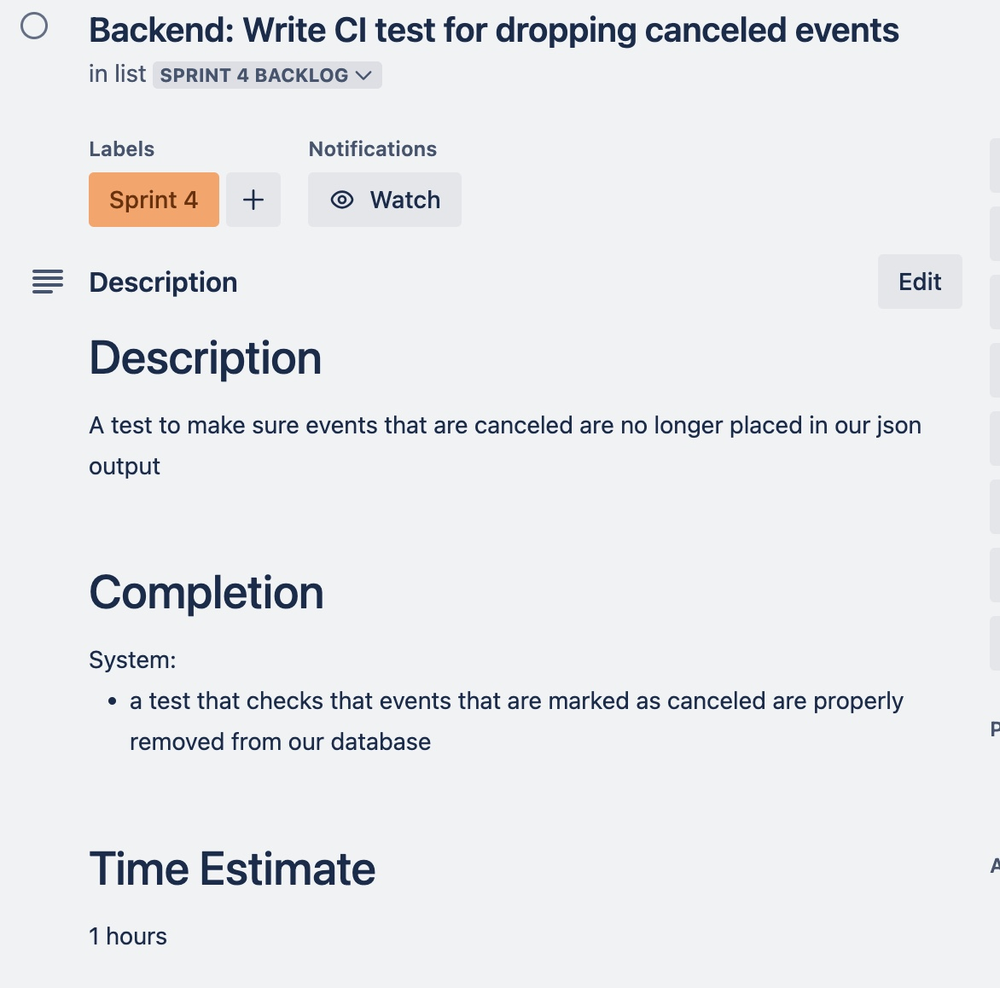

# (1) External Documentation and Stakeholder Meetings

> Description (TODO: DELETEME before completion)
>
> In your Sprint Journal, add an entry that includes the following for each stakeholder:
>
> - Who you met with
>   - Name, occupation, and other relevant information about the stakeholder
>   - Date and time of the stakeholder meeting
> - Description of the test session and feedback
>   - What was their behavior of interacting with the documentation?
>   - Did they succeed or get stuck?
>   - What feedback did they provide about documentation?
>   - What questions did you ask, and what were the stakeholder's answers?

# (2) Internal Documentation Lab

## Group Anthony and Michael

### A: Anthony B: Michael

We worked on the login process code for Kotlin.

We made no code changes but furthered documentation. We added inline comments above the async functions in the AuthModel file. We added documentation to the Login Screen file specifically to explain which chunks corresponded to which UI elements and what all they did (specifically useful for the login button). Added inline comments to specific branching/conditionals that may be confusing when not knowing what is being evaluated.

The function headers and data class headers were helpful in understanding what each data class was used for or what a function did specifically. 

Hash of commit [2d3da7a](https://github.com/seehorne/GetGrinnected/commit/2d3da7a58e94008b983e033657d2b8fefc0dc63b)

Our issue tracker was up to date on what the next step entailed.

### A: Michael B: Anthony

We worked on the homepage for Swift.

We made no code changes but furthered documentation. We added a header comment to the enum class for tags. We added a header comment to the home screen discussing what each UI option did so that it was easy to discern what they were used for.

The in line comments for the homescreen were helpful specifically for which brackets closed which statements. Additionally the comments on the specific values of the variables.

Hash of commit [b679543](https://github.com/seehorne/GetGrinnected/commit/b679543f27ed9e8f232e589c698d09ed25adbddc)

## Group Budhil and almond

### A: almond B: Budhil

We looked at `src/backend/api.js`, lines 118 through 225 (functions `getEventsBetween`, `parseParamDate`, and `parseQueryTags`).

We agreed that, although there were already comments on many relevant parts of the code, these comments tended not to be helpful from an external perspective. Because of that, we decided they should be modified to better explain themselves to a reader who is less familiar with the code. To summarize, a lot of documentation needed to answer the question "where does this variable come from?" or "What does that function call do in the scope of the whole thing?"

Existing documentation did a decent job of saying what each thing did in most cases, but lacked enough depth to be easily understood. 

For this one, we made changes across more than one commit so I can't give you a hash. However, I can give you a link to the PR page that shows
exactly what was changed based on this lab: <https://github.com/seehorne/GetGrinnected/pull/64/files>

> If you *really* want a commit hash, most changes are part of commit [ac70e9d](https://github.com/seehorne/GetGrinnected/commit/ac70e9dd6d85291ea54f5c202a1b3a6b3eb28f89).

### A: Budhil B: almond

We looked at the way the event cards were defined for Swift. We didn't look at specific lines, more jumping around to different parts of the code as we needed to in order to understand what was going on.

In this case, a lot of the documentation changes we made were to add new information where there had previously been no comments. Budhil brought up that this was something Michael had wanted when reviewing code as well. In particular, we wrote documentation centering around the questions of "Why does this struct have to have these items in it?" and "There's a lot going on here, how can I understand it overall?"

There wasn't much previous documentation that could help us in this case.

You can see our changes at the commit with hash [695e0af](https://github.com/seehorne/GetGrinnected/pull/62/commits/695e0affb3f11506795e6bde4454b452f7f8c2c7).

## Group Ellie and Ethan

### A: Ellie B: Ethan
> TODO: DELETEME ON COMPLETION
> THIS SECTION STILL NEEDS TO BE FILLED OUT.

### A: Ethan B: Ellie
MainActivity.kt, lines 41-186

We worked together to make sure both of us had an understanding of the current code, how it works and what it was struggling with. The code previously had no documentation so I added basic function documentation. I also added some comments on specific lines to describe what they do to properly understand the function at a deeper level. 

 You can see our changes at the commit with the hash [b0d3ca9](https://github.com/seehorne/GetGrinnected/commit/b0d3ca92759449de424f9ef4d40c14623d970d83)

On the other side, for Ellie showing code to Ethan, we worked with the functions dropPastEvents and findID, both in scrape.js. The changes we made to the documentation were to add overarching function documentation for findID and update the overarching function documentation for dropPastEvents to include the time_based parameter that was added in the most recent commit about this code prior to this lab: this was necessary if Ethan were to take over the next step of writing CI tests for it so he would know how to call things. There was already some overarching documentation for the dropPastEvents which outlined parameters except for the time_based one, as well as inline comments on both functions explaining what certain lines did, which Ethan found helpful in understanding the general behavior of the function. We also made a Trello task for the CI tests, which doesn’t have a before pic because it didn’t exist before, the after image is shown here.

The changes are at the coomit with hash [009e931](https://github.com/seehorne/GetGrinnected/commit/009e9315376b8346ba5f1883898fc59831bf36d7)

# (3) Self-Selected Work toward Minimum Viable Product (MVP)

> Description (TODO: DELETEME ON COMPLETION)
> - In a Sprint Journal entry, remind us what your MVP is (look back to Milestone 1 where you described what features would be included in your MVP)
> - Describe what work, if any, remains toward delivering your MVP

# (4) **Generative AI** Experiment

Each experiment will be an h2 (`##`) below, with individual questions under h3s (`###`). 

## Exploring Authorization Possibilities

This was done almond on their own.

### What were initial goals and expectations?

Written before starting the experiment.

I have been overwhelmed by how many options there are for implementing authorization, and the articles that talk about it are unhelpful because they are AI-generated and don't answer the questions I actually have.

I want to find out a good option for us to use in our software, based on our needs. I will figure out what needs are relevant by asking the AI.

Then, I want to be shown an example of what the flow might look like between different components.

### How was AI used?

I'm going to do a play by play of the prompts I used, and what I got from the responses.

1. I asked "I am working on developing an app that users log in to, and I want to explore what options I have for authorizing a user when they log in. Can you give me a list of some ways to do that?"

   It gave me many options (which I skimmed, seeing some familiar names) and then asked me "Would you like examples in code (e.g., for Node.js, Django, etc.), or want help picking the best one based on your app's structure or tech stack?"

2. "Actually, it might be more helpful to think about the process of how they actually log in first. How about that?"

   It corrected me on authentication vs authorization (oops, silly me, I shoulda remembered this), then gave me a list of more helpful results.

3. I singled out "passwordless authentication" because we had talked about it in the past, and then I asked this.

   "Let's start by looking into passwordless authentication. Can you give me a short (1-3 sentence) summary of both "magic link" and "one time code"?"

   It did a good job at this.

4. I asked, "I've been wanting to use OTP, but one problem I was worried about is whether the user would need to log in and do a one-time code every time they opened the app. Would that be a concern?"

   It brought up storing a token on the device, and highlighted that it would be important to set an expiry so that the token would not be misused or stolen. For security.

5. I said "I want to hear more about token expiry and refreshing. Could you give me a little bit more detail? This might also be the right time to bring up the software stack: I am using Express for the API. Is there any sort of builtin solution, or would it be one I implement?"

   This was a multipart question, and it gave a long answer. These are the things I got from it.

   * to do this, you use both Access Tokens and Refresh Tokens.

     * access tokens last a short time (~15min) are are passed with each API request as authorization.
     * refresh tokens last longer (~7 days) and you keep it in secure storage on the device.
     * you use the refresh token to request new access tokens when they expire, and to request new refresh tokens when needed.
       * so an API endpoint to refresh them. you can refresh both, which stops the refresh token from expiring.

6. I thanked ChatGPT for its help, because I'm allowed to positively influence the data that's stored about me.

7. Later I came back and asked "I have one last question that should be quick. The server obviously has to store these tokens somewhere, but how does it know when to delete them from storage? And is it important to encrypt them somehow?"

   It answered that access tokens don't get stored on the server, just verifies them. This is a JWT thing.

   For refresh tokens, it said that those do need to get stored (e.g. in a database) and it's important to encrypt them so they don't get used for bad purposes.

   For cleaning them out, it said you can delete them when a user logs out and also have a cron job that runs every once in a while and cleans any that got missed.

8. That was a satisfactory answer to me, so I thanked it again and decided to be done.

### What impact did it have?

It had a large impact on the design of things going forward, provided other team members are okay with and agree with the things it said. I was keeping a critical eye to possible inaccuracies, but I want to also bring in the feedback of another dev who knows more about this sort of stuff so I can make sure I'm not messing things up by going in this direction.

### To what extent did this impact match goals and expectations?

Since I specifically wrote the goals and expectations before hand, I followed them pretty closely and it matched well.

I ended up deciding not to ask for any sort of diagram, since I decided this was not information that would be helpful to me right now. Besides, I have no idea if it would do a good job at making a diagram or not--natural language is what it's built for.

### Optional Questions

For this response I'll answer them, but not in complete sentences. The goal is to make discussion easier without requiring a lot of extra work.

6. Helped learning, avoided sifting through generated and slop articles which are all I get trying to search this stuff up.

7. I'm taking its advice at face value, and if it were telling me things that were wrong and I went forward that could have implications on the security of our software and our users' data.

   Also, like with all Gen AI on the market, each query I make has massive environmental consequences! I don't like using AI! And yet I did anyway, and I made a lot of queries since I am not awesome at prompting. Bad.

8. It's good at planning stuff, but also I really really hate to recommend people use AI under pretty much any circumstance.

9. I think current policies are good because they require citation. I don't really care about the difference for using AI for one purpose versus another though, so that distinction has never had much of an impact on how I approach the course.

## Understanding how to make a Swift view update when a value changes in another view

This experiment was done by Michael.

### What were initial goals and expectations?

My initial goal was to understand how to update our event list view when the date we were looking at changed. I needed to do this because where the date we were looking at was stored in a different view than the event list.

I expected the AI to at least give me an easier to understand explantion of how to do what I wanted than all the documentation online.

### How was AI used?

I started by asking ChatGPT how to update a view in Swift when a value in another view changed. This gave me a decent explanation, but I still did not know how to fully implement it. So, I pasted in a portion of my code into ChatGPT and it was able to give me an explanation that was in the context of my code.

I also ended up using ChatGPT to read a bunch of event JSON data and give me a list of the tags in alphabetical order. This was used to make my event tags enum.

### What impact did it have?

This had a very large impact. I had been stuck on this problem for hours and could not find anything helpful online. It helped me more fully understand how I should set up my code and what things like @Binding and @Published meant in Swift.

Using AI to read all the event tags as had a huge impact. I saved a bunch of time by not doing it manually.

### To what extent did this impact match goals and expectations?

The impact matched my goals and expectation very well. In fact, it was even more helpful than I originally thought. I was pretty skeptical of it to start with.
